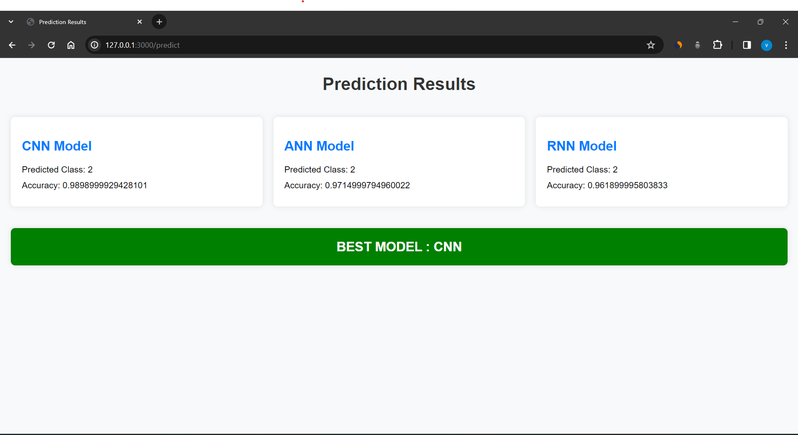

# Enhancing Handwritten Digit Recognition using Deep Learning Algorithms

## User Interface

*The user interface includes a browse file button for uploading images.*

## Uploaded Image


*This image shows an example of a handwritten digit (digit 2 from MNIST) uploaded to the system.*

## Predicted Results


*The predicted result along with accuracies is displayed in the above image. The best model is highlighted.*

## Installation

1. Clone the repository:
    ```
    git clone https://github.com/varaprasadtarunkumar/HandWrittenDigitRecognition.git
    ```

2. Install dependencies:
    ```
    pip install -r requirements.txt
    ```

3. Run the application:
    ```
    python app.py
    ```

## Usage

1. Open the UI by navigating to `http://localhost:3000` in your web browser.
2. Click on the "Browse" button to upload a handwritten digit image.
3. Once uploaded, view the predicted results displayed on the UI.

## Conclusion

Based on the results obtained, it can be concluded that Convolutional Neural Networks (CNN) outperform the other algorithms for handwritten digit recognition.

## Contributors

- Gannem Jahnavi Devi ([@gannemjahnavi](https://github.com/gannemjahnavi))

## License

This project is licensed under the Apache-2.0 license - see the [LICENSE](LICENSE) file for details.
